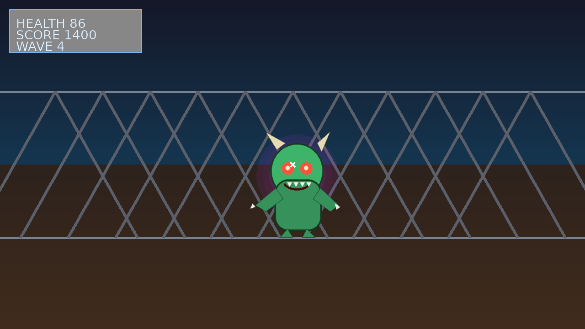
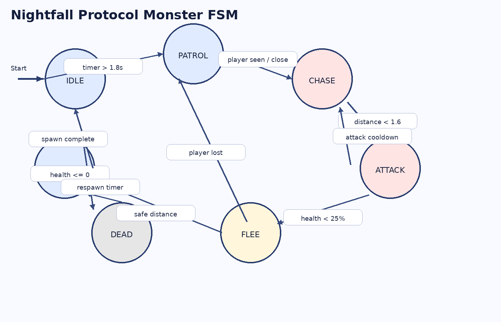

# Nightfall Protocol

Nightfall Protocol is a browser-based first-person shooter built with **HTML5 Canvas, CSS, and vanilla JavaScript**. The player survives inside a sci-fi arena while fighting FSM-controlled monsters. The project follows the uploaded assignment requirements for a **Canvas game with a reusable Finite State Machine**.

## Screenshot



## Game Features

- First-person shooter gameplay with **pointer lock** so the mouse stays fixed in the center during play
- Main menu, pause menu, HUD, and game over screen
- Canvas-based pseudo-3D corridor rendering
- Monster AI driven by a **reusable FSM class**
- Wall textures, monster sprite art, and generated sound effects included in the project
- Wave and score progression with replayable combat
- Mute option and looping background music

## Controls

- **W / A / S / D** - Move
- **Mouse move** - Look around
- **Left click / mouse down** - Shoot
- **R** - Reload
- **Right click** - Quick reload shortcut
- **Mouse wheel** - Reload shortcut
- **Shift** - Sprint
- **ESC** - Pause / Resume
- **M** - Mute toggle
- **P** - Start from keyboard on main menu

## Implemented Events

This project implements more than the required 10 event types:

1. `load`
2. `resize`
3. `focus`
4. `blur`
5. `visibilitychange`
6. `keydown`
7. `keyup`
8. `keypress`
9. `click`
10. `mousemove`
11. `mousedown`
12. `mouseup`
13. `contextmenu`
14. `wheel`
15. `touchstart`
16. `touchmove`
17. `touchend`
18. Custom events: `gameStart`, `gameOver`, `levelUp`
19. `requestAnimationFrame`
20. `setTimeout` and `setInterval`

## FSM Overview

Each monster uses the reusable `FiniteStateMachine` class from `js/fsm.js`.

### FSM States

- `IDLE`
- `PATROL`
- `CHASE`
- `ATTACK`
- `FLEE`
- `DEAD`
- `RESPAWN`

### FSM Diagram



### Transition Table

| Current State | Input / Condition | Next State | Action |
|---|---|---|---|
| IDLE | Timer > 1.2s | PATROL | Start roaming |
| IDLE | Player visible and near | CHASE | Track player |
| PATROL | Player visible and near | CHASE | Move toward player |
| CHASE | Distance < attack range | ATTACK | Attack player |
| CHASE | Health < 25% | FLEE | Retreat from player |
| CHASE | Player lost and far away | PATROL | Resume wandering |
| ATTACK | Distance increases | CHASE | Re-engage chase |
| ATTACK | Health < 25% | FLEE | Try to escape |
| ANY ACTIVE STATE | Health <= 0 | DEAD | Hide sprite and start respawn timer |
| DEAD | Respawn delay elapsed | RESPAWN | Reset health and position |
| RESPAWN | Spawn animation timer complete | IDLE | Return to active loop |
| FLEE | Safe distance reached | PATROL | Resume roaming |

## Bot AI Behavior

Monsters begin in `IDLE`, move into `PATROL`, and switch to `CHASE` when they detect the player using a simple line-of-sight check. When they close enough, they enter `ATTACK` and damage the player. If their health falls low, they enter `FLEE` and retreat. When killed, they enter `DEAD`, wait for a respawn timer, then return through `RESPAWN` back to `IDLE`.

## Technologies Used

- HTML5 Canvas
- Vanilla JavaScript (ES6 modules, classes, const/let)
- CSS3
- Pointer Lock API
- Audio API via HTMLAudioElement

## Project Structure

```text
/game
  /assets
    /images
    /sounds
  /js
    main.js
    player.js
    enemy.js
    fsm.js
  /css
    style.css
  index.html
  README.md
  fsm-diagram.png
```

## How to Run

1. Open the `game` folder.
2. Start a local server in that folder. Example:
   - VS Code Live Server, or
   - `python -m http.server`
3. Open `index.html` through the local server.
4. Click **Play** and allow pointer lock.

## GitHub Pages

After uploading to GitHub, deploy the `game` folder through GitHub Pages and replace this placeholder:

**Play URL:** `https://your-username.github.io/nightfall-protocol/`

## Suggested Commit Plan

- `feat: initialize project structure and canvas layout`
- `feat: add player movement and pointer lock controls`
- `feat: implement reusable FSM for monsters`
- `feat: add rendering, HUD, and menus`
- `feat: add sounds, textures, and final polish`

## Submission Checklist Mapping

- Working Canvas FPS structure: yes
- 10+ events: yes
- Reusable FSM module: yes
- 5+ states: yes
- Main menu / pause / game over: yes
- Sounds and mute: yes
- README and FSM diagram: yes
